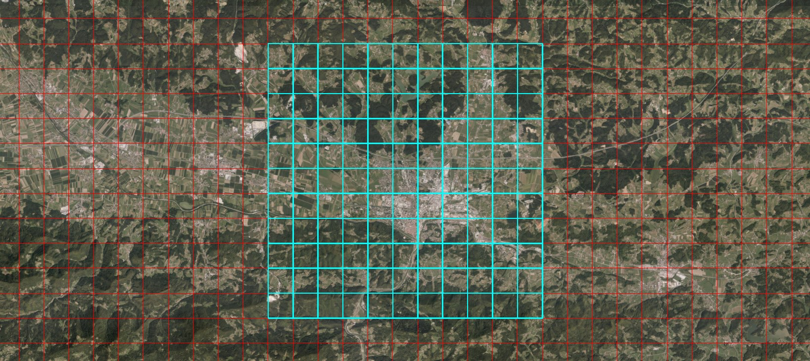

BTE Celje - Navodila
====================

Opozorilo
---------

Ta navodila so namenjena vsem, ki nameravajo graditi Celje oz. okolico, in sicer naslednje območje.

Obrazložilo
-----------

Kot ste že mogoče opazili, je natančnost terena, ki jo generira Terra z pomočjo AWS Terrain Tiles, zelo slaba. Da bi se izognili temu, sem se odložil uporabit LIDAR podatke. Ker ti vsebujejo tudi podatke o zgradbah in vegetaciji, sem najprej trebal izluščiti le teren iz teh LIDAR podatkov ki jih najdemo na arso. Več o tem lahko izveste [tukaj](https://github.com/DavixDevelop/TerraLidar). Skratka, ko dobimo podatke v pravilnem formatu, za Terra, jih lahko uprabimo, ampak, ker Terra ne podpira pomeri podatkov za teren, uporabimo nadgradnjo Terra, tako imenovan Terra++. Več o tem izveste [tukaj](https://github.com/bitbyte2015/terraplusplus).

Navodila
--------
- Sledimo tipični namestitvi za BTE
- Ko namestimo vse potrebno prenesemo Terra++ iz naslednje [povezave](https://jenkins.daporkchop.net/job/BuildTheEarth/job/terraplusplus/job/master/)
- V raziskovalcu pod Dokumenti, ustvarimo novo mapo Minecraft, in v njej mapo CustomTerrain (npr. C:\Users\david\Documents\Minecraft\CustomTerrain)
- Iz naslednje [povezave](https://1drv.ms/u/s!ApjeN2QtEv53tLkNCeJsH0AkonG59w?e=rRyivr) prenesemo stisnjeno mapo v zgoraj omenjeno mapo (CustomTerrain)
- Preneseno stisnejno mapo razširimo v mapo CustomTerrain. Po razširitvi stisnjene mape se v mapi CustomTerrain pojavi mapa Flats
- Od tu naprej sledimo navodilam [tu](https://github.com/BuildTheEarth/terraplusplus/wiki/Custom-terrain-dataset-guide), in kot pot do nabora podatkov uporabimo zgoraj omenjeno mapo (npr. file://C:/Users/david/Documents/Minecraft/CustomTerrain/Flats/${zoom}/${x}/${z}.png)
- Ko ustvarimo svet, se z ukazom /tpll 46.225556, 15.266604 premestimo v Celje

Primerjava
----------

Spodaj vidimo primer terena, pri uporabi privzetih podatkov, ki jih uporablja Terra. Opazimo da ima teren zelo nizko kakovost.

V primerjavi z uporabo podatkov izluščenih iz LIDAR podatkov, ima teren boljšo kvaliteto in z tem boljši končni izgled.

